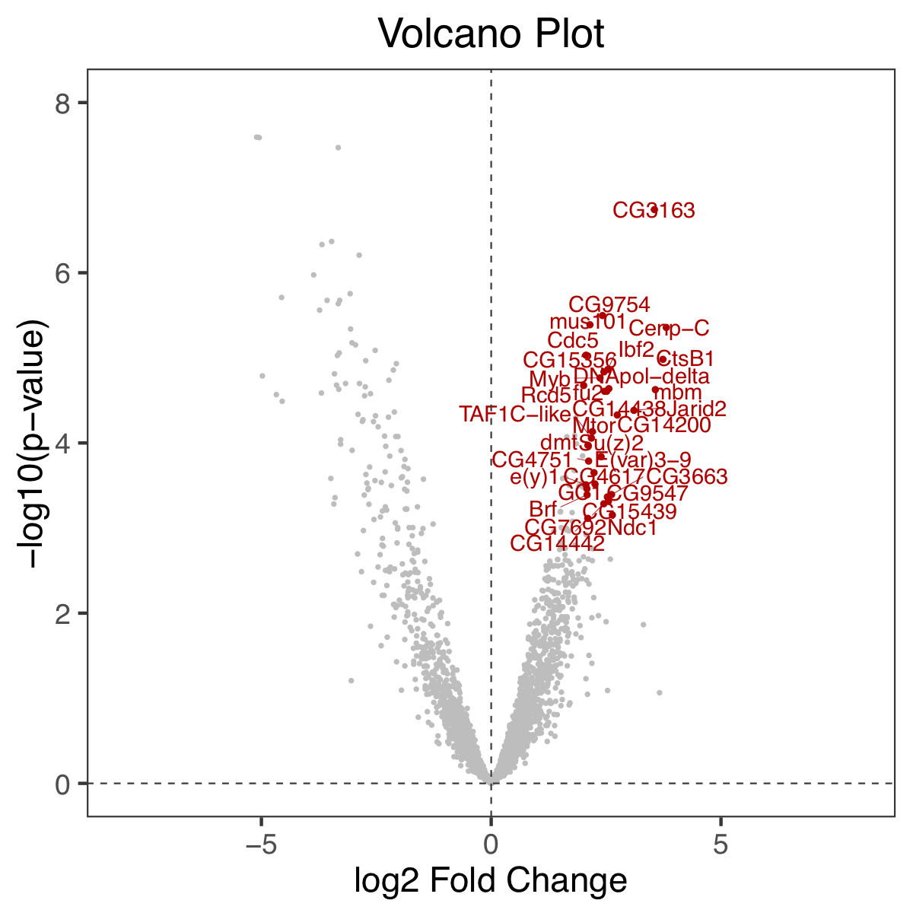

```{r setup, include=FALSE}
knitr::opts_chunk$set(echo = TRUE)
```


This is a Shiny app to create scatterplots with several labeling options.

* Input: csv or xlsx
* Repel points and text
* Selection by names or by values
* Output: pdf - further adjustable


```{r, echo=FALSE}
library(png)

example1 <- readPNG("example1.png")
example2 <- readPNG("example2.png")

par(mfrow=c(1,2))

plot(0:1,0:1, type='n', xlab="", ylab="", xaxt="n", yaxt="n", bty="n")
rasterImage(example1, xleft = 0, ybottom = 0, xright = 1, ytop = 1)

plot(0:1,0:1, type='n', xlab="", ylab="", xaxt="n", yaxt="n", bty="n")
rasterImage(example2, xleft = 0, ybottom = 0, xright = 1, ytop = 1)


```


<!--  -->
<!--  -->


