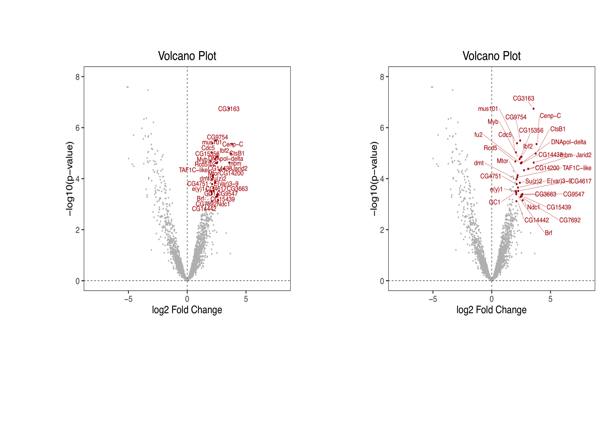
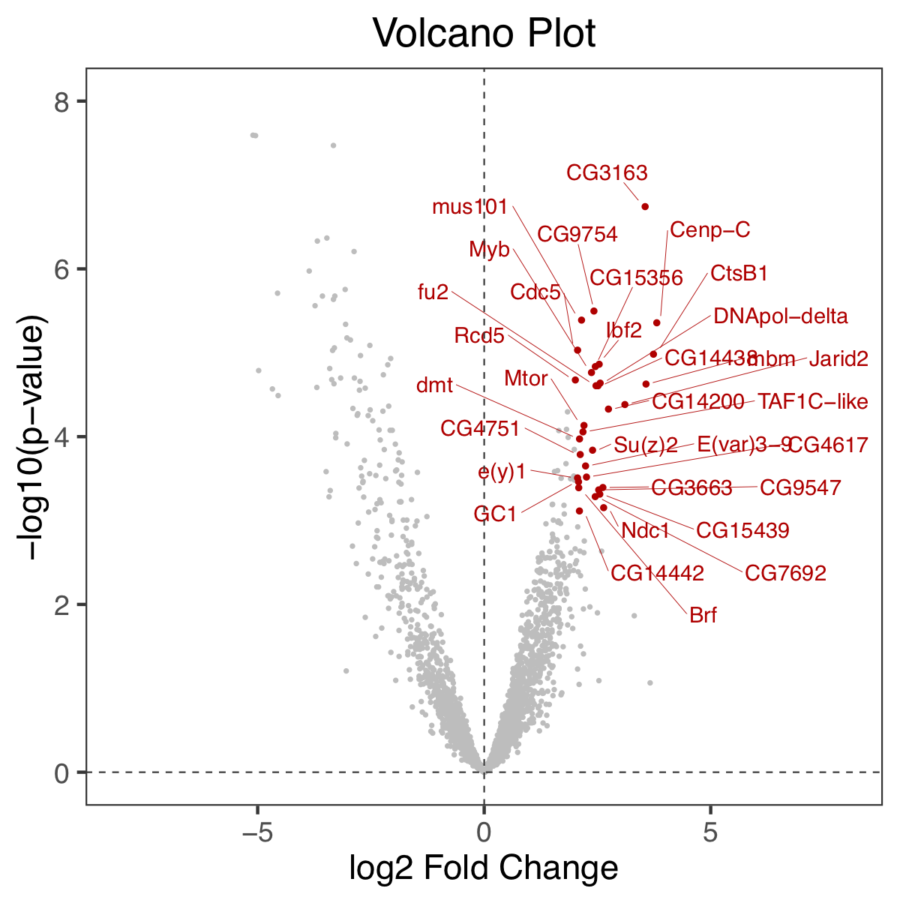

##LabeledPlot

This is a Shiny app to create scatterplots with several labeling options.

* Input: csv or xlsx
* Repel points and text
* Selection by names or by values
* Output: pdf - further adjustable

<!-- -->

<!--  -->
<!--  -->

